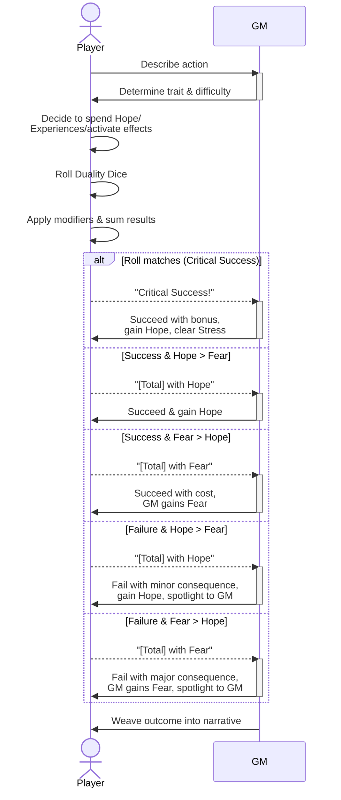

# Action Rolls

```mermaid
sequenceDiagram
    actor Player
    participant GM
    Player->>GM: Describe action
    activate GM
    GM->>Player: Determine trait & difficulty
    deactivate GM
    Player->>Player: Decide to spend Hope/<br/>Experiences/activate effects
    Player->>Player: Roll Duality Dice
    Player->>Player: Apply modifiers & sum results
    alt Roll matches (Critical Success)
        Player-->>GM: "Critical Success!"
        activate GM
        GM->>Player: Succeed with bonus,<br/>gain Hope, clear Stress
        deactivate GM
    else Success & Hope > Fear
        Player-->>GM: "[Total] with Hope"
        activate GM
        GM->>Player: Succeed & gain Hope
        deactivate GM
    else Success & Fear > Hope
        Player-->>GM: "[Total] with Fear"
        activate GM
        GM->>Player: Succeed with cost,<br/>GM gains Fear
        deactivate GM
    else Failure & Hope > Fear
        Player-->>GM: "[Total] with Hope"
        activate GM
        GM->>Player: Fail with minor consequence,<br/>gain Hope, spotlight to GM
        deactivate GM
    else Failure & Fear > Hope
        Player-->>GM: "[Total] with Fear"
        activate GM
        GM->>Player: Fail with major consequence,<br/>GM gains Fear, spotlight to GM
        deactivate GM
    end
    GM->>Player: Weave outcome into narrative
```
