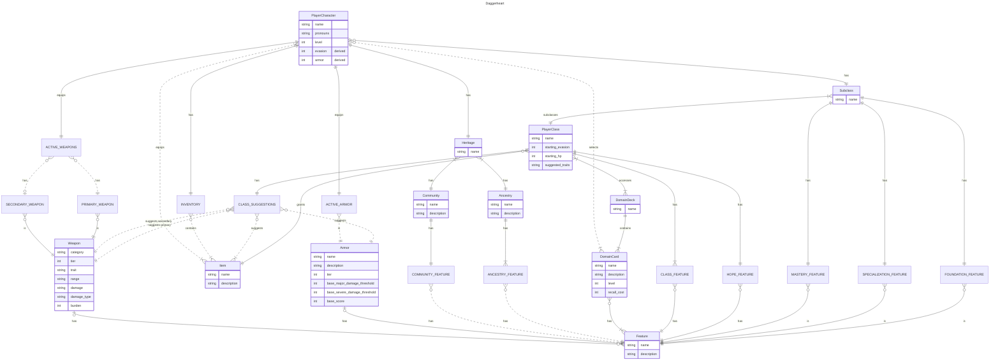

# Player Character Creation

```mermaid
---
title: Daggerheart
---
erDiagram
    PC[PlayerCharacter] {
        string name
        string pronouns
        int level
        int evasion "derived"
        int armor "derived"
    }
    HERITAGE[Heritage] {
        string name
    }
    ANCESTRY[Ancestry] {
        string name
        string description
    }
    COMMUNITY[Community] {
        string name
        string description
    }
    SUBCLASS[Subclass] {
        string name
    }
    PLAYER_CLASS[PlayerClass] {
        string name
        int starting_evasion
        int starting_hp
        string suggested_traits
    }
    ARMOR[Armor] {
        string name
        string description
        int tier
        int base_major_damage_threshold
        int base_severe_damage_threshold
        int base_score
    }
    FEATURE[Feature] {
        string name
        string description
    }
    ITEM[Item] {
        string name
        string description
    }
    WEAPON[Weapon] {
        string category
        int tier
        string trait
        string range
        string damage
        string damage_type
        int burden
    }
    DOMAIN-DECK[DomainDeck] {
        string name
    }
    DOMAIN-CARD[DomainCard] {
        string name
        string description
        int level
        int recall_cost
    }

    PC 0+ to 1 SUBCLASS: has
        SUBCLASS 1 to 1 FOUNDATION_FEATURE: has
            FOUNDATION_FEATURE 0+ to 1 FEATURE: is
        SUBCLASS 1 to 1 SPECIALIZATION_FEATURE: has
            SPECIALIZATION_FEATURE 0+ to 1 FEATURE: is
        SUBCLASS 1 to 1 MASTERY_FEATURE: has
            MASTERY_FEATURE 0+ to 1 FEATURE: is
        SUBCLASS 1+ to 1 PLAYER_CLASS: subclasses
            PLAYER_CLASS 0+ to 1 ITEM: grants
            PLAYER_CLASS 1 to 1 HOPE_FEATURE: has
                HOPE_FEATURE 0+ to 1 FEATURE: has
            PLAYER_CLASS 1 to 1+ CLASS_FEATURE: has
                CLASS_FEATURE 0+ to 1 FEATURE: has
            PLAYER_CLASS 1+ to 1+ DOMAIN-DECK: accesses
                DOMAIN-DECK 1 to 1+ DOMAIN-CARD: contains
                    DOMAIN-CARD 0+ to 1+ FEATURE: has
            PLAYER_CLASS 1 to 1 CLASS_SUGGESTIONS: has
                CLASS_SUGGESTIONS 0+ optionally to 1 WEAPON: suggests-primary
                CLASS_SUGGESTIONS 0+ optionally to 1 WEAPON: suggests-secondary
                CLASS_SUGGESTIONS 0+ optionally to 1 ARMOR: suggests
                CLASS_SUGGESTIONS 0+ optionally to 1+ ITEM: suggests

    PC 1 to 1 INVENTORY: has
        INVENTORY 0+ optionally to 1+ ITEM: contains
    PC 1 to 1 ACTIVE_ARMOR: equips
        ACTIVE_ARMOR 0+ optionally to 1 ARMOR: is
    PC 1 to 1 ACTIVE_WEAPONS: equips
        ACTIVE_WEAPONS 0+ optionally to 1 PRIMARY_WEAPON: has
            PRIMARY_WEAPON 0+ to 1 WEAPON: is
        ACTIVE_WEAPONS 0+ optionally to zero or one SECONDARY_WEAPON: has
            SECONDARY_WEAPON 0+ to 1 WEAPON: is
    PC 1 to 1 HERITAGE: has
        HERITAGE 1+ to 1 ANCESTRY: has
            ANCESTRY 1 to 1+ ANCESTRY_FEATURE: has
                ANCESTRY_FEATURE 0+ optionally to 1 FEATURE: has
        HERITAGE 1+ to 1 COMMUNITY: has
            COMMUNITY 1 to 1 COMMUNITY_FEATURE: has
                COMMUNITY_FEATURE 0+ optionally to 1 FEATURE: has
    PC 1+ optionally to 1+ ITEM: equips
    PC 0+ optionally to 1+ DOMAIN-CARD: selects

    ARMOR zero or one to 0+ FEATURE: has
    WEAPON zero or one to 0+ FEATURE: has
```
