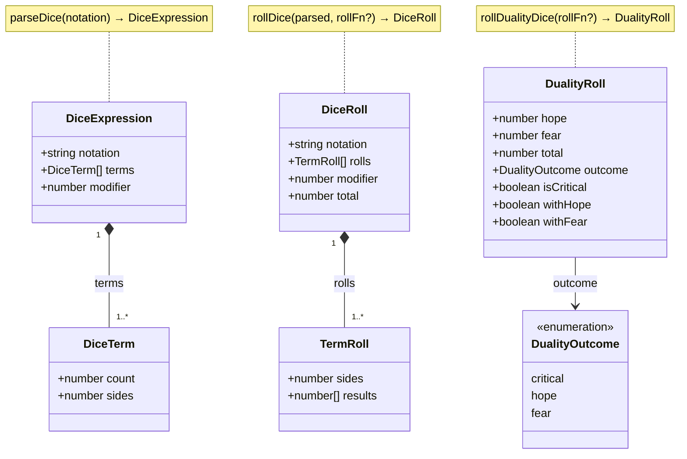

# Dice

## Naming conventions

| Term                 | Meaning                                                                           |
| -------------------- | --------------------------------------------------------------------------------- |
| **notation**         | Raw dice string, e.g. `"2d6+3"`                                                   |
| **expression**       | Parsed form of a notation string (`DiceExpression`)                               |
| **term**             | One die group within an expression, e.g. the `2d6` in `2d6+1d8`                   |
| **Roll** (suffix)    | Result object returned by a roll function (`DiceRoll`, `TermRoll`, `DualityRoll`) |
| **Outcome** (suffix) | String classification of a roll result, not a result object (`DualityOutcome`)    |

## Class diagram

